# Network Programming Task 1
By : Ahmad Fathan Afdhali

## 1 TCP Finite State Machine

Pada gambar diatas, terdapat contoh proses inisiasi dan penghentian koneksi TCP yang diringkas kedalam diagram transisi keadaan Finite State Machine. Finite State Machine sendiri adalah model logis untuk perilaku sistem yang kondisi internalnya berubah karena adanya peristiwa yang ditentukan.
Hal pertama yang perlu diperhatikan adalah bahwa bagian dari state transisi adalah tipikal. Tanda pada transisi client normal adalah panah berwarna hijau, dan transisi server normal adalah panah berwarna putus-putus merah. Transisi lain tentu saja valid namun ada kemungkinan tidak dapat digunakan atau tidak dapat diharapkan.

Penjelasan proses dari gambar diatas adalah dua transisi yang mengarah ke Kotak 'CONNECTION ESTABLISHED' berhubungan dengan pembukaan koneksi, dan dua transisi yang mengarah dari state 'CONNECTION ESTABLISHED' adalah untuk memberhentikan koneksi. kondisi 'CONNECTION ESTABLISHED' adalah tempat transfer data dapat terjadi antara kedua ujung di kedua arah panah.

Empat kotak pada kiri bawah diagram didalam kotak putus-putus dan memberi labelnya 'active CLOSE'. Dua kotak lain yaitu 'CLOSE_WAIT' dan 'LAST_ACK' dikumpulkan dalam kotak putus-putus dengan label 'passive CLOSE'.

Kemudian ketika 'passive OPEN' dijalankan pada titik akhir yang masuk kedalam state 'LISTEN'. Hal tersebut terjadi saat setiap kali server memulai proses daemon atau background proses yang diharapkan untuk menunggu permintaan TCP yang masuk. Ketika TCP menerima flag SYN dalam status tersebut, maka flag SYN akan memulai proses 'Three Way Handshaking' untuk pindah ke keadaan 'CONNECTION ESTABLISHED'.

'OPEN active' biasanya dijalankan oleh klien untuk memulai transaksi TCP dengan server yang diberikan. Mengikuti panah hijau atau jalur hijau, dapat dilihat dengan jelas bahwa 'Three Way Handshaking' juga mengarah ke kondisi 'CONNECTION ESTABLISHED'.

## 2 PROGRAM IF - ELSE dan FOR

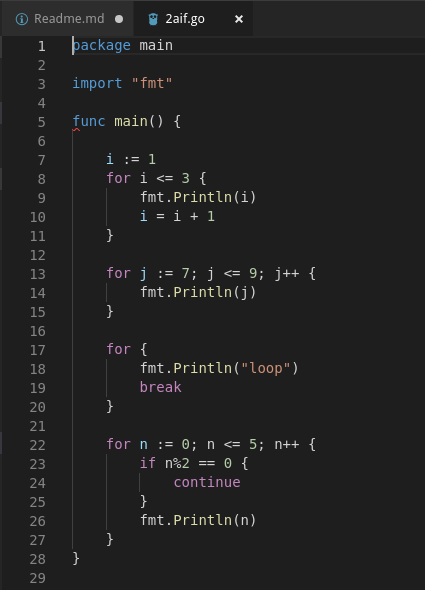

Pada gambar diatas adalah source code untuk sintaks for yang outputnya adalah :

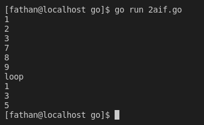

Cara Kerja dari sintaks perulangan for diatas adalah variabel i yang bernilai 1 dan <= 3 yang fungsinya menambah sejumlah 1 secara terus menerus sampai program berhenti. Lalu untuk perulangan for yang kedua adalah penjumlahan variabel j yang bernilai 7 dan <= 9 yang akan dijumlahkan sejumlah 1. Untuk perulangan for yang ketiga yaitu terdapat **Break** yang digunakan untuk mengakhiri perulangan for ketiga dan pada perulangan for yang keempat terdapat **Continue** yang digunakan untuk melanjutkan perulangan for. Pada seluruh perulangan for pada gambar apabila kondisi seluruhnya TRUE maka akan dieksekusi dan apabila FALSE akan mengeksekusi perulangan for yang berikutnya.

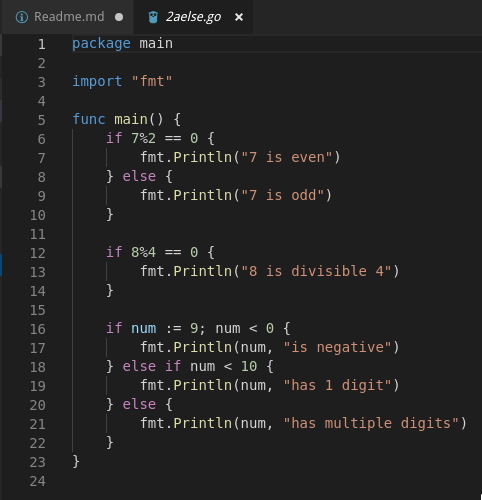

Pada gambar diatas adalah source code untuk sintaks if dan else yang outputnya adalah :

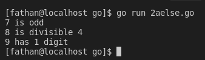

Cara kerja dari sintaks if dan else diatas adalah pencarian bilangan 7 adalah genap atau ganjil dengan cara membagi 7 dengan 2. Lalu untuk if dan else yang kedua adalah pencarian apakah bilangan 8 bisa dibagi dengan bilangan 4. Lalu untuk if dan else yang ketiga adalah pengecekan angka 9 yang apabila 9 < 0 maka angka 9 adalah angka negatif, lalu apabila 9 < 10 maka angka 9 memiliki 1 digit atau jika lebih dari 10 maka angka 9 memiliki digit lebih dari 1.

## 3 PROGRAM FUNCTION dan ARRAY

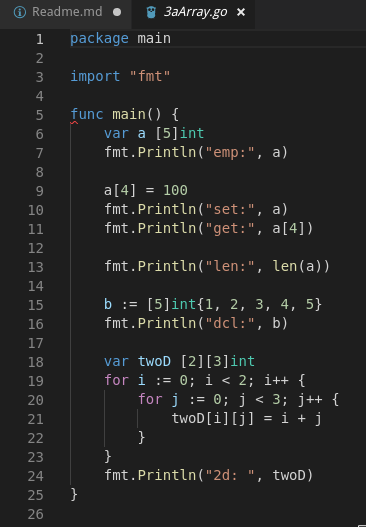

Pada gambar diatas adalah source code untuks sintaks array yang outputnya adalah :

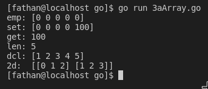

Cara kerja dari source code Array diatas adalah variable a yang panjangnya 5 dimana array index ke-4 nya ditentukan dengan nilai 100, lalu untuk variable b merupakan array dengan panjangnya 5 yang sudah terisi dengan nilai 1 - 5. Lalu variable twoD adalah array 2 dimensi dengan dimensi 2x3 yang didalamnya ada perulangan for yang akan menjumlahkan i dan j yang akan diisi membentuk array 2x3.

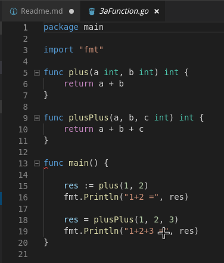

Pada gambar diatas adalah source code untuks sintaks function yang outputnya adalah :

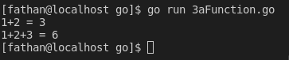

Cara kerja dari source code Function diatas adalah terdapat fungsi plus yang digunakan untuk menambah angka a + b dan fungsi plusPlus yang digunakan untuk menambah angka a + b + c.

## 4 PROGRAM STRUCT dan METHOD

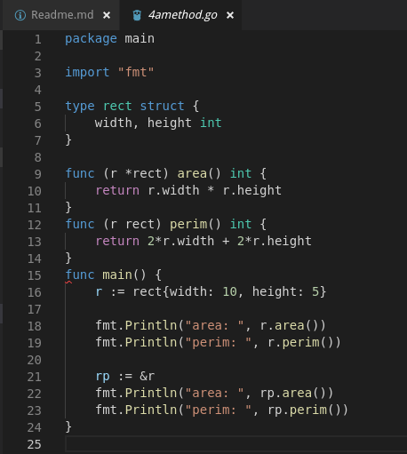

Pada gambar diatas adalah source code untuks sintaks method yang outputnya adalah :

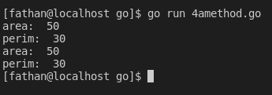

Cara kerja dari source code Method diatas adalah terdapat variable **width** dan **height** yang gunanya untuk menghitung **area** dan **perim** dengan jumlahnya 10 dan 5.

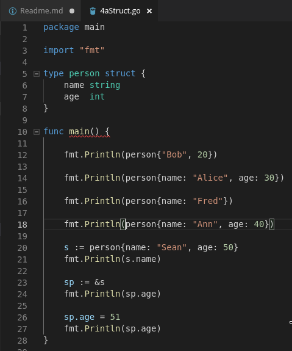

Pada gambar diatas adalah source code untuks sintaks struct yang outputnya adalah :

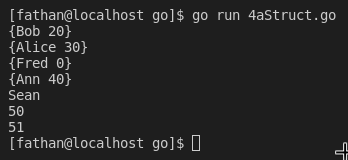

Cara kerja dari source code Struct diatas adalah menampilkan umur dari orang orang yang ada dengan memilih tipe struktur dari yang akan ditampilkan.

## 5 PROGRAM MULTIPLE RETURN VALUE dan COMMAND LINE

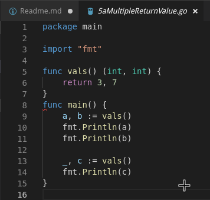

Pada gambar diatas adalah source code untuks sintaks Multiple Return Value yang outputnya adalah :

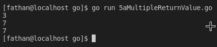

Cara kerja dari source code Multiple Return Value yaitu terdapat fungsi yang memiliki nilai return 3 dan 7 untuk mengisi variable a dan b. Lalu ada variable c dimana hasilnya adalah 7.

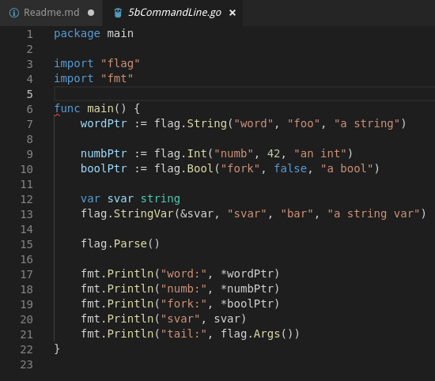

Pada gambar diatas adalah source code untuks sintaks Command Line yang outputnya adalah :

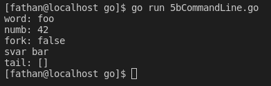

Cara kerja dari source code Command Line yaitu variable wordPtr yang isinya word;foo;a sting. Lalu variable yangg kedua numbPtr yang isinya dengan numb;42;an int dan variable yang ketiga boolPtr diisi dengan fork;false'a bool. Lalu variable keempat svar yang isinya adalah svar;bar;a string var. Lalu akan menampilkan tiap hasil variable.

## 6 PROGRAM SIMPLE WEB APPLICATION

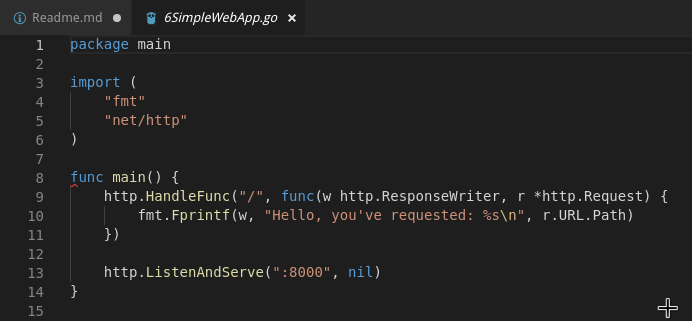

Pada gambar diatas adalah source code untuk Simple WEB App yang outputnya adalah :

Cara kerja dari source code Simple Web App yaitu melakukan pembuatan localhost yang dimana fungsi http.HandleFunc() yang digunakan untuk registrasi rute dan handler-nya, sedangkan fungsi http.ListenAndServe() digunakan untuk menjalankan server.
