# Network Programming Task 2

By: Ahmad Fathan Afdhali

## Host Lookup

Code Program adalah :

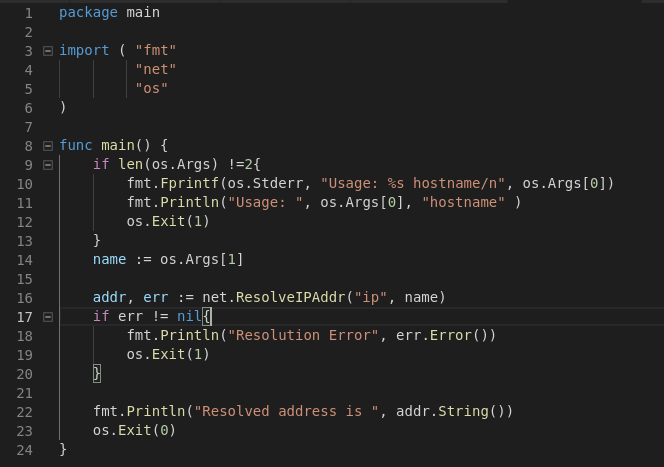

Hasil Running adalah :

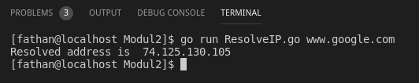

Penjelasan dalam Finite State Machine :

## Service LookUp

Code Program adalah :

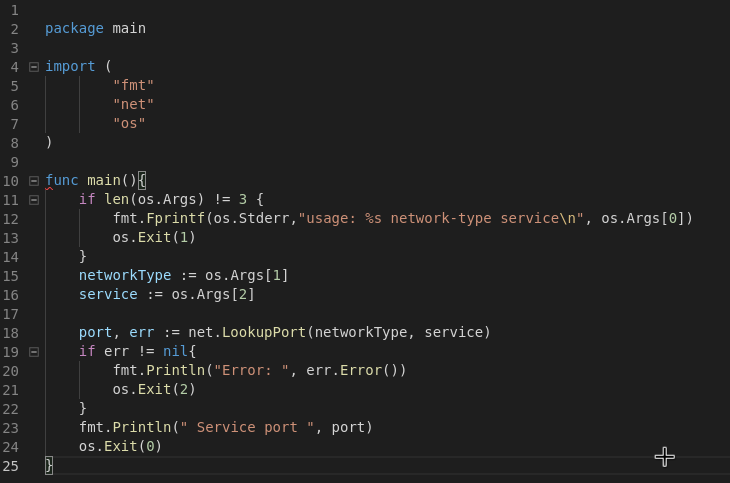

Hasil Running adalah :

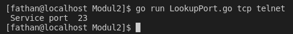

Penjelasan dalam Finite State Machine :

## TCP Client

Code Program adalah :

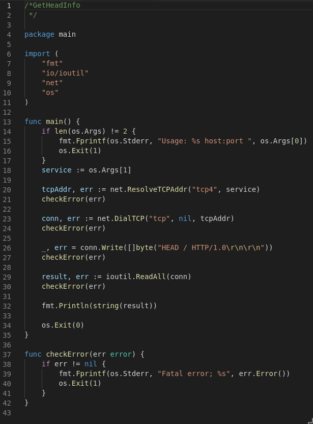

Hasil Running adalah :

Penjelasan dalam Finite State Machine :

## Raw Sockets and the IPConn Type

Code Program adalah :

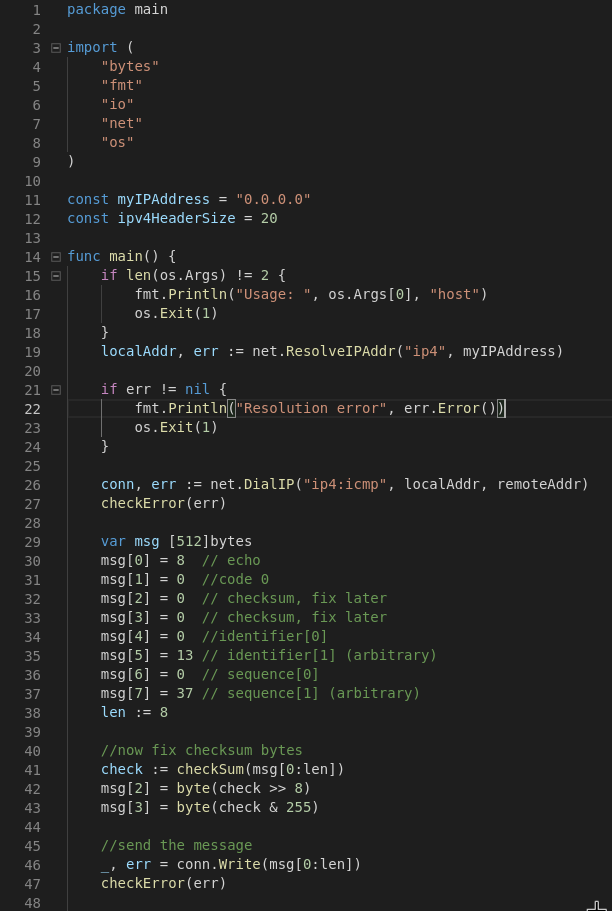
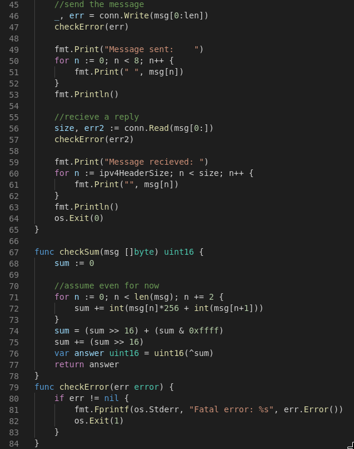
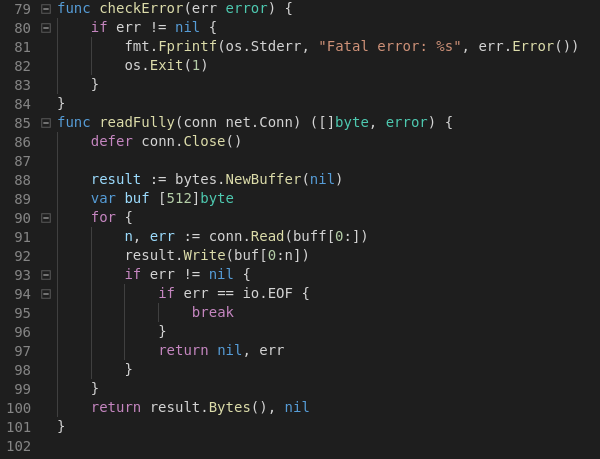

Hasil Running adalah :

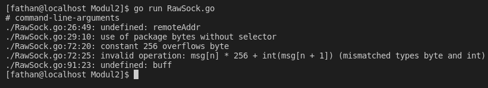

Penjelasan Cara Kerja :

## Multi Threaded Server 

Code Program adalah :

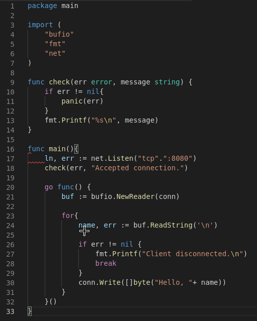

Hasil Running dan Penjelasan :
belum bisa pak, masih error

## Multi Threaded Server 2

Code Program adalah :

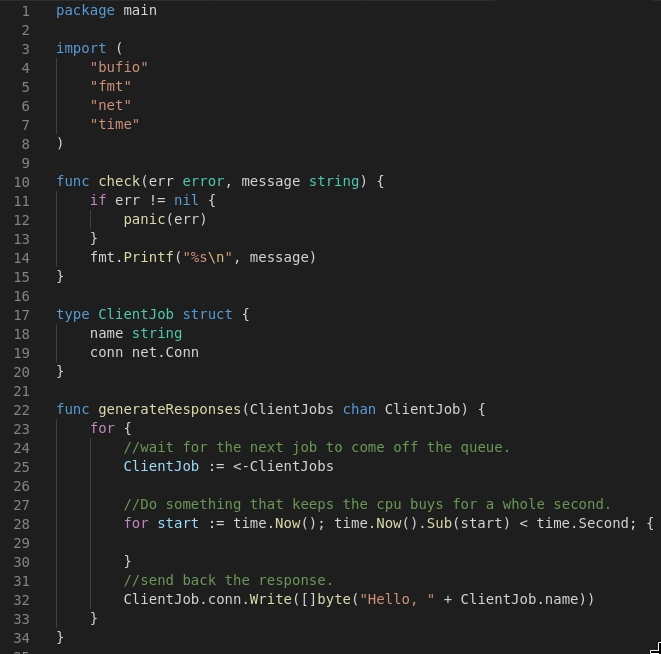
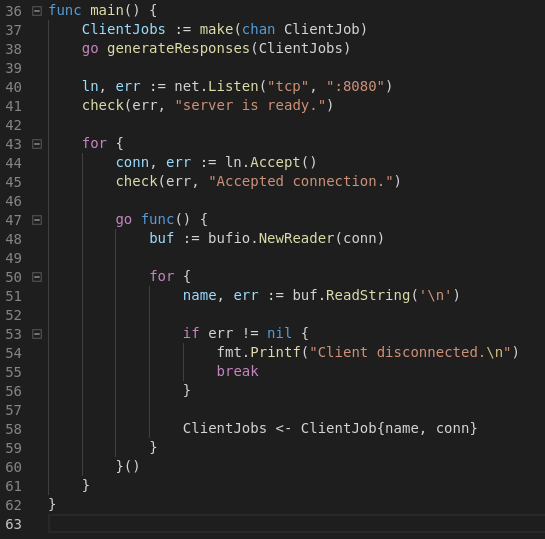

Hasil Running dan Penjelasan :
belum bisa pak, masih error
