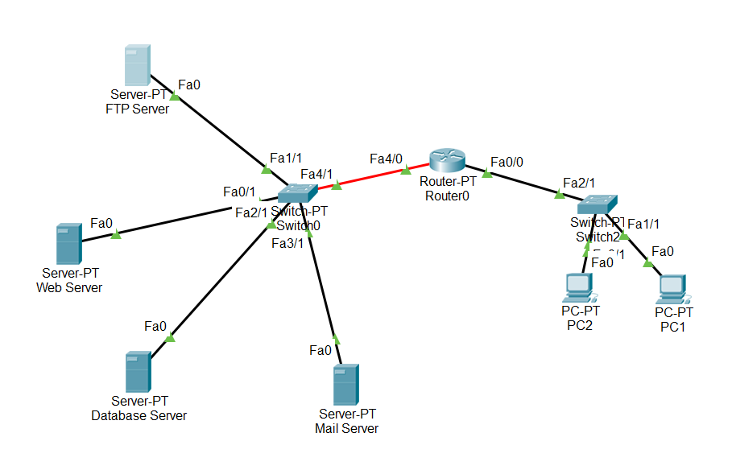
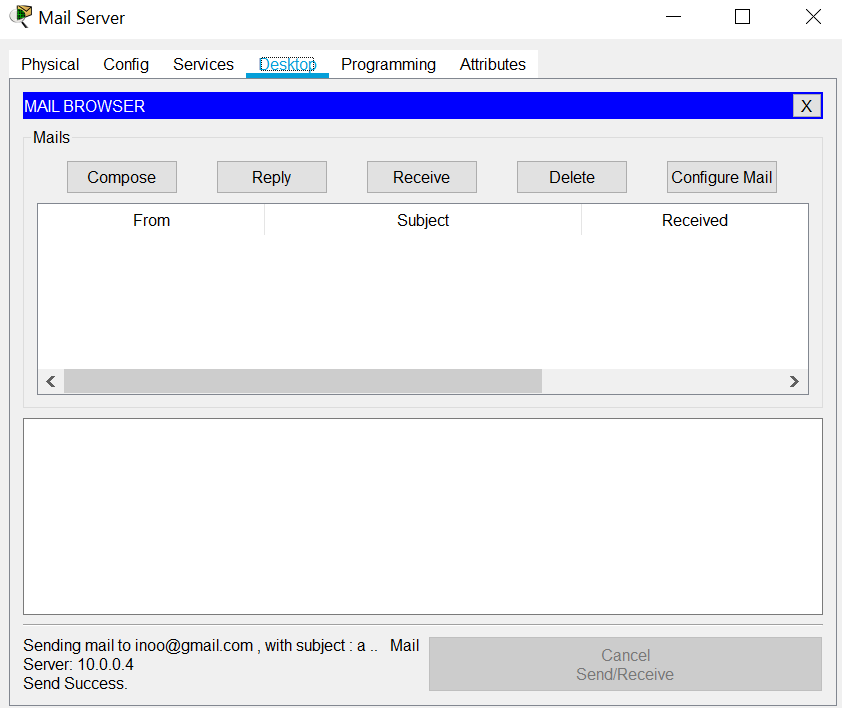
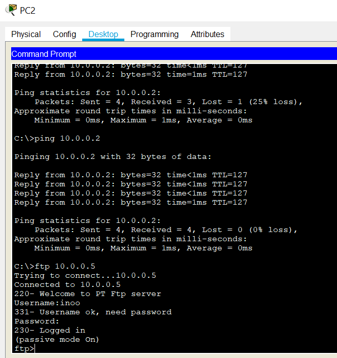

# Network Programming Task 3
 Kelompok 5 :
 Ahmad Fathan Afdhali 1301164220
 Raisha Apriandhini 1301164408
 Yudi Kurniawan 1301154143

## Network Planning Perusahaan

1. Proses Bisnis yang kami terapkan adalah proses bisnis pada perusahaan koperasi.

2. Analisis dari mengapa perusahaan kami membutuhkan web server, database server, FTP server, mail server, dan server monitoring.
   adalah sebagai berikut :
    -	Web Server : tempat sarana bagi user/pengguna koperasi, agar bisa memantau keaadaan koperasi dimanapun, atau sebagai sarana untuk transaksi dengan koperasi.
    -	Database : Untuk menyimpan transaksi koperasi dengan user
    -	Mail server : Agar koperasi dapat terus mengirim email, dengan menggunakan email server dari koperasi itu sendiri
    -	FTP server : tujuan adanya FTP server di koperasi adalah agar dapat sharing data, dan sebagai sarana tempat penyimpanan  data bagi user koperasi
    -	Server monitoring : Untuk memantau keadaan web server, database, mail server, dan FTP server berjalan dengan semestinya, atau memantau keadaan server seperti CPU usage, Memory consumption, I/O network, dsb.

3. Untuk orang yang terlibat dalam proses instalasi dan maintenance jaringan adalah seorang enggineer pada bidang instalasi dan maintenance tersebut.
    Bisa seseorang dalam perusahaan yang sudah bersertifikat dalam hal itu.

## Network Topology

 Gambaran Topologi pada perusahaan koperasi kami adalah sebagai berikut :

 

 Topologi tersebut adalah topologi berjenis hybrid. Guna Web server sebagai alamat DNS yang digunakan pada perusahaan.

 Keterangan IP, Interface, dan Device Jaringan yang digunakan :
    IP PC 1 : 192.168.0.3
    IP PC 2 : 192.168.0.2
    IP ROUTER : 192.168.0.1 & 10.0.0.1
    IP FTP Server : 10.0.0.5
    IP Database Server : 10.0.0.3
    IP Web Server : 10.0.0.2

    Interface menggunakan server, switch, dan router lalu device menggunakan PC

Lalu berikut adalah contoh uji coba dari web server, ftp server, dan mail server :

Web Server :

Mail Server :

FTP Server :

 
